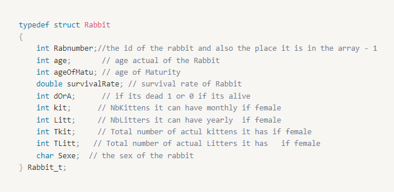

# Rabbit Population Simulation

by :

Woldemichael Eyosias

# Tables of contents:

1. [**Introduction**](#introduction)
2. [**Structure**](#structure)
    1. [**Structure of rabbit**](#structure-of-rabbit)
    2. [**Structure of information**](#structure-of-information)
3. [**Files and functions**](#files-and-functions)
4. [**Finding the probability**](#finding-the-probability)
    1. [**Finding the probability of the number of litters**](#finding-the-probability-of-the-number-of-litters)
    2. [**Finding the probability of the number of Kittens**](#finding-the-probability-of-the-number-of-kittens)
5. [**Rules of fertility**](#rules-of-fertility)
6. [**Rules of survival**](#rules-of-survival)
    1. [**Graph with different survival rate occurrence**](#graph-with-different-survival-rate-occurrence)
7. [**Main function**](#main-function)

# Introduction:

In this project we will propose a stochastic discrete simulation of the growth of a rabbit population. To do this we have been given some key aspects of the mortality of a rabbit.

The instructions informs us that a female rabbit can give birth approximately every month but it tells us also that it can have 3 to 9 litters per year meaning that the rabbit can give birth 3 times or 5 … or 9 times a year not less or higher than 3 and 9 we will talk about the probabilities later on. Let’s talk about the amount of rabbits it can have per litter, there is an equal chance to have 3 to 5 babies per litter. and a bit less 2 or 6 kittens( we will also talk about how we handle this part). Eventually we also have an equal chance to have either a male or female rabbit.

While giving birth we are told that there is a 15 % chance of the mother not surviving and that there is a 10 % chance also of infertility that month. The survival rate for adults is 75 % and for the babies is 50 % , when the rabbit reaches 7 years old it’s survival rate diminishes every year.

Now that we know all the facts we will use all our notions we learned and functions we made in the past lab exercise to give an approximation of the population of rabbits in 20 years.

# Structure:

## Structure of Rabbit:

A rabbit should have these following informations at its initialization:

- The id of the rabbit to locate it in the array, the age of the rabbit, the age for its maturity, its survival rate, if its dead or alive, number of kittens it can have, Total number of kittens it had if female, number of litters it can have yearly ,Total number of Litters it had if female and the Sexe.

Our structure in c code looks like this:



## Structure of Information:

To not complicate the structure of the rabbit or make it lighter and less time consuming we will only create one structure that gives common information like for example the number of rabbits alive, the number of female rabbits alive or dead …

```c
typedef struct Rabbit_other_info
{
    double * CDF_for_litter; // the CDF array calculated to assign number of Litter
    int sizeCDF; // size of the array of the CDf
    int idofActualRab; // id of the last rabbit generated inside the array
    int totRabbitgenerated; // total rabbits generated
    int totBabiesGen; // totol babies generated
    int totalRabbitMalesgen; //total male rabbits generated
    int totalRabbitfemaGen; // total female rabbits generated
    int totNumbRabAlive; // total number of Rabbit alive
    int numberMalesAlive; // number of males alive
    int numberFemalesAlive; // number of females alive
    int totdeath; // total death of rabbit
    int totDeFem; // total dead of females;
    int totDeMal; // total dead of Males;
    int totdeathAt_Child_birthFem_Matu; // total number of female death at child birth (meaning after giving birth)
    int totdeathBeforeMat;// total death before maturity
    int totDeFemBeMatu; // total dead females before Maturity;
    int totDeMalBeMatu; // total dead Males before Maturity;
    int totdeathAfMat; // total male and female death after maturity
    int totDeFemAfMatu; // total dead females after  Maturity;
    int totDeMalAfMatu; // total dead Males after Maturity;
} Rab_t_Oth_info;
```

As you can see having these structure inside each rabbit is at first irrelevant but also time and space costly if we have a very big array of structure of rabbits.

# **Files and functions**

As we've seen in the introduction, to realize the instructions required we wrote some functions down. Our programme consists of 5 c files if we don’t count mt19937ar.c and one header file. In total we have 2 structures and 21 functions. But only 11 of them are important.

We will see some of the functions we will talk about later on. Such as creating a rabbit or simulating a population.

how do we create a rabbit ?

here is the signature of the function:

```c
Rabbit_t *    create_Rabbit(Rab_t_Oth_info * info)
```

We now have seen the structure of a rabbit so creating it is just allocating a structure rabbit in which we initialise all the variables. After that we associate it with an id to keep track of the rabbits and to not go through the whole array we allocated, which improves our computation. We return the rabbit or the structure to which we store it in an array of structures.

And our next question would be how to simulate a population ?

here is the signature of the function :

```c
Rab_t_Oth_info* StartRabbitSimu(int numberOfRabInitial, int years);
```

If we know how to create a rabbit then we can also simulate a population. Our function takes a number of population to start off and the number of years we simulate it. After creating the first initial population we convert the years into months. Now we know the number of months we can have a loop that will go from the first month to the year converted into months. But we have to do this also for each rabbit; this in turn adds another loop to go through all the rabbits generated. And for each statement we meet if it is true we in turn apply it to the rabbit.

And every month we increase the Rabbit age, we diminish its survival rate if needed or we check every 4 month if it should survive.

```c
Rab_t_Oth_info*   StartRabbitSimu(int numberRabAtstart , int years)
{

    Rabbit_t ** arrOfRab = (Rabbit_t **) calloc(NBRABMAXARR,sizeof(Rabbit_t *));
    Rab_t_Oth_info * info = (Rab_t_Oth_info *) calloc(1, sizeof(Rab_t_Oth_info));
    for (int i = 0; i < numberRabAtstart; i++)
    {
        arrOfRab[i] = create_Rabbit(info);
        info->idofActualRab++;
    }

    int mois = ReturnYearIntoMonth(years);
    int year = 0;
    for(int i = 1; i <= mois; i++)
    {
        for(int j = 0; j < info->totRabbitgenerated; j++)
        {
							// for each condition met we apply it to the rabbit
        }
    }
    Free_The_Space(arrOfRab, info);

    return info;
}
```

# **Finding the probability**

As we stated in the introduction, we will now show what decisions we took and how to find each probability because some of them were a bit vague.

## Finding the probability of the number of litters

In the first part of the Instructions we are told that a female rabbit can give up 3 to 9 litters per year. A litter, in this context means how many times a rabbit can give birth per month in a year. But since in the instructions it is said that the probability of having a particular litter is not uniform, we have a greater chance to get a 6, a bit less 5 and 7 and so on.

To find the Probability of each litter in this context we can choose to apply a gaussian where its characteristic is a bell curve shape.

To do so we use the previous lab functions to generate the bell curve.

But before we do anything we need to assign our array of observations a number of observations for each cell of the array. This will help us with the implicit instructions given to us for the chances of litters per year. Playing with the number of observations we can try to find a well rounded bell curve

For the first attempt we gave this observation as you can see in the code below :

```c
int         size    = 7;
double  *   Obs     = calloc(size, sizeof(double)); // chances for 3 to 9 litters
Obs[0] = 100, Obs[1] = 200,  Obs[2] = 350,
Obs[3] = 500,
Obs[4] = 350, Obs[5] = 200, Obs[6] = 100;
```

Using the result provided by the function of Lab 2, we can find the number of frequencies of each litter and with a python script we show the result in a graph.

```python
import numpy as np
import matplotlib.pyplot as plt
L = [0, 0, 0,  55483 , 111635 , 193916 , 278034 , 194251 , 110893 , 55788 ]
largeur = 0.3
index = np.arange(0, 10, 1)
plt.bar(index, L, largeur, color='b')
plt.xticks(index)
plt.ylabel(" Litters frequencies", color='r')
plt.xlabel("Number of Litters", color='b')
plt.title("Bell Curve")
plt.axis([2, 10, 0 , 300000])
plt.show()
```


Below we have the code

After finding the cumulative probability density function it's pretty much easy to provide the function that assigns a rabbit mother a number of kittens per year..

```c
void    nbLitters_Assign(Rabbit_t * Rabbit, double * CDF_Litter, int size)
{
    double chance_ofNblitt = genrand_real1();

    for(int i = 0; i < size; i++)
    {
        if(chance_ofNblitt <= CDF_Litter[i])
        {
            Rabbit->Litt = i + 3;
         //this means if it finds an interval which it is inside
         //we add the number of litters it can have in a year
				 // and since it has between 3-9 and since the array starts from 0
			// we add 3, because the max of array CDF is 6 we add 6 + 3 = 9 max litter    // in a year same for the first element 0 + 3 = 3 which is min litter in a year.
            break;
        }
    }
}
```

## Finding the probability of the number of Kittens

The instructions of the lab informs us that for a litter we have an equal chance to obtain 3 to 5 kittens and a bit less to have 2 or 6. This means that 3, 4 and 5 have a probability of 0.25 and 2 and 6 have a probability of 0.125 which adding all the values gives us 1 which is the total. This also tells us that a rabbit can only have a minimum 2 babies and maximum 6 babies.

With this information it is quite easy to construct a function that does the exact instruction above.

```c
void  nbKittens_Assign(Rabbit_t * Rabbit)
{
    double  probOfKittens = genrand_real1();                                                    //  probability of being in a interval that assigns number of kitten

    if(probOfKittens >= 0 && probOfKittens < 0.25)
    {
        if (probOfKittens <= 0.125)
        {
            Rabbit->kit = 2;
        }
        else
        {
            Rabbit->kit = 6;
        }
    }
    if(probOfKittens >= 0.25 && probOfKittens < 0.50)
                       // as we can see the chance of having
    {
        Rabbit->kit = 3;                               // 3, 4 and 5 is equal
    }
    if(probOfKittens >= 0.50 && probOfKittens < 0.75)
    {
        Rabbit->kit = 4;
    }
    if(probOfKittens >= 0.75 && probOfKittens <= 1)
    {
        Rabbit->kit = 5;
    }
}
```

# Rules of Fertility:

- There is an equal chance to have a female and male kitten.
    - This could be done by generating a random drawing, we can see this below:

        

- Each year there is a 10 % infertility chance for a female rabbit.
    - This could also be done by generating a random drawing we can see how below:
    - but there is also a 15 % chance of death at childbirth so we **chose, we made a decision** to not let the mother give birth if her chance of survival is low, meaning there will not be a baby born. Instead the mother would die.

    ```c
    void    motherGivesLife(Rabbit_t ** Rabbit, int place, Rab_t_Oth_info * info)
    {
        double MotherChanceOfInfertily = genrand_real1();
        double MotherchanceOfdeath = genrand_real1();
        if (MotherChanceOfInfertily >= 0.10) // means the mother is fertile
        {
            if (MotherchanceOfdeath > 0.15)
            {// means the mother has 85% chance survivale at child birth

               // code continues to do other procedures

            }
           else
            { //  baby is not born mother dies
                Rabbit[place]->dOrA = 1;
                info->totdeathAt_Child_birthFem_Matu++; // mother dies giving birth
                info->totNumbRabAlive--;
                info->numberFemalesAlive--;
                info->totdeath++;
                info->totDeFem++;
                info->totDeFemAfMatu++;
                info->totdeathAfMat++;
            }
        }
    }
    ```

- For the Sexual maturity we choose to give a uniform probability so sexual maturity is reached between 5 to 8 month after birth (its only at his maturity she can consummate).
    - We can do apply this instruction with the function below.

    


# Rules of Survival:

We can simulate the probability of death using the rules given in the instruction.

- We know that there is a 15 % chance of death for female rabbit at child birth
- For adults who reached sexual maturity the survival rate is 75%
- For little rabbit those below sexual maturity it is 50 %
- Ongoing diminishing survival rate
    - Once it reaches 7 years old its survival rate diminishes by 15 % yearly reaching 0 at 12
    - we suppose that when the rabbit is at 7 years old his survival rate is 75 % because substracting 15 % every year will go 0 at 12 years that's what we want.

With these instruction we can construct the rules :

Before we talk about the monthly survival rate let’s see first how we intend to decrease the survival rate every year. We check if the rabbit is mature , if it is alive and after that we check if its age is higher than 7 years (equals to 84 month). After that we diminish the survival rate and if it is 0 we kill it.

```c
void   Dimini_Surv_Matu_Rab_yearly(Rabbit_t * Rabbit, Rab_t_Oth_info * info)
{
    if(Rabbit->age >= Rabbit->ageOfMatu)
    { // if the rabbit reaches its mature age 5, 6, 7 or 8 months
        if(Rabbit->dOrA == 0)
        {
            if(Rabbit->age > 84)
            { //it is 7 years converted from month
                Rabbit->survivalRate -= 0.15;  // diminishe survival rate by 15 %
                if(Rabbit->survivalRate <= 0.0)
                {    // // when the survivale rate reaches 0 %
                    Rabbit->dOrA = 1;//  kill it

                }
            }
        }
    }
}
```

For the monthly survival rate if the the rabbit reached sexual maturity we can do something like this. We draw a random number, we check if it’s mature and if the random number is higher than the survival rate we kill it.

```c
void    survival_Rate_Monthly(Rabbit_t * Rabbit, Rab_t_Oth_info * info)
{
    double ChanceOfSurv_adult = genrand_real1();
    double ChanceOfSurv_kids = genrand_real1();

   if(Rabbit->age >= Rabbit->ageOfMatu)
    {
        if (ChanceOfSurv_adult > Rabbit->survivalRate)
        {      // An adult rabbit has
						// Rabbit->survivalRate % chance of survival
            Rabbit->dOrA = 1; // Rabbit dies
        }
    }// else the rabbit survives to see onather day
```

If the rabbit is hasn’t reached maturity we can have something similar like this.

```c
if(Rabbit->age < Rabbit->ageOfMatu)
    {
        if (ChanceOfSurv_kids > Rabbit->survivalRate) // for little rabbit it is
				{       // for little rabbit it is                                                                           //  Rabbit->survivalRate % chance of survival
            Rabbit->dOrA = 1; // rabbit dies
        }
    }     // else the little rabbit survives to see onather day
}
// end the function
```

<aside>
💡 **But there is a choice to be made about the survival rate occurrence do we do it**

**yearly, monthly … ?**

</aside>

## To answer this question Let’s see some graph and make a decision

### Graph with different survival rate occurrence

We simulated with an initial population of 20 rabbits for over 20 years.

And this is what we get when we apply the survival rate every :

### 3 month


As we can see the number of population increases only by 10 and then stagnates this indicates that there are no rabbits generated. It also indicated that the rate of generation is quite low so our population dies faster.


Like in the first graph we can see that the number of deaths starts to stagnate after the first year; this means that all the rabbits died in the first year.


We can see in the graph our population of rabbits die off quickly, especially the most important one, which is the mothers, they die quicker than the males.

<aside>
💡 We can conclude that applying the survival rate every 3 month isn’t beneficial to analyse, we have a very low population generated and our population dies off quickly. Unless the rabbits lived in a very hostile environment having to occur the survival rate function every 3 month isn’t beneficial.

</aside>

### Every 4 month


<aside>
💡 We can see in the first graph that the population generated is higher than the graph which had a survival rate every 3 month it is quite high and the rate of the growth is exponential. Around 1.5 million rabbits were generated. After 20 years we have around 250 000 rabbits alive unlike the other graph with a survival rate of 3 month with no population left.

</aside>

### Every 5 month


<aside>
💡 We see a very drastic increase in the generation of a population in 20 years. We have around 350 000 000 rabbits generated. Around 10 million rabbits are alive after 20 years but we do not think this is a realistic growth rate and also since the computation time is very high just to simulate once, we decided that the best choice that suits us and has a more realistic Fibonacci growth is applying not every 5 month but every 4 month.

</aside>

# Main function:

After talking about the rules of survival, after making a choice on the occurrence of the survival rate function (which is every 4 month), and after seeing the graphs of a simulation of 20 years we already have all the information in the 3 graphs but we need to remember that the result we obtained is only after 1 stochastic simulation experiment we have to try different experiments with a confidence interval of 99% because of stochastic variability being very high.

In Our main function we have the following function:

```c
void            ComputeConfiInter(int exp, int initialRabNum, int Years);
```

This function will take a number of experiments and it will do the simulation with an initial rabbit population for over a certain year. It will store all the data in arrays to pass to the function that will compute the confidence interval and the results will be stored in a file (tp4.txt) that will be created.

```c
for (int i = 0; i < exp; i++)
    {
        info = StartRabbitSimu(initialRabNum, Years);
        Exp[i] = info->totRabbitgenerated;
        Exp2[i] = info->totBabiesGen;
        Exp3[i] = info->totNumbRabAlive;
        Exp4[i] = info->numberFemalesAlive;
        Exp5[i] = info->numberMalesAlive;
        Exp6[i] = info->totdeath;
        Exp7[i] = info->totdeathAt_Child_birthFem_Matu;
        Exp8[i] = info->totdeathBeforeMat;
        Exp9[i] = info->totdeathAfMat;
        mean += Exp[i];
        mean2 += Exp2[i];
        mean3 += Exp3[i];
        mean4 += Exp4[i];
        mean5 += Exp5[i];
        mean6 += Exp6[i];
        mean7 += Exp7[i];
        mean8 += Exp8[i];
        mean9 += Exp9[i];
        free(info);
    }
		printf("For the results for %d years repeated over %d experience, you can have them in the file tp4.txt.\n", Years, exp);
    fprintf(fd, "##############################################\n");
    fprintf(fd, "These are the values for %d years repeated over %d experience\n", Years, exp);
    confiInter2(exp, Exp, mean, "Number of Rabbits Generated", fd);
    confiInter2(exp, Exp2, mean2, "Number of Baby rabbit generated", fd);
    confiInter2(exp, Exp3, mean3, "Number of Rabbit Alive", fd);
    confiInter2(exp, Exp4, mean4, "Number of Rabbit Female Alive", fd);
    confiInter2(exp, Exp5, mean5, "Number of Rabbits Male Alive", fd);
    confiInter2(exp, Exp6, mean6, "Number of Rabbits dead", fd);
    confiInter2(exp, Exp7, mean7, "Number of Female Rabbit dead After giving birth", fd);
    confiInter2(exp, Exp8, mean8, "Number of Rabbits dead before Maturity", fd);
    confiInter2(exp, Exp9, mean9, "Number of Rabbits dead after Maturity", fd);
```

The function below:

```c
void            confiInter2(int exp, double * Exp, double mean, char * str, FILE * fd);
```

Is the function that finds the confidence interval it has up to 100 values of the student score values for a 99 percent confidence interval. This function is the function we made in the lab 3 nothing has changed except the student score values. For each array of experience and number of experience it finds the confidence interval and writes it in a file called tp4.txt if it doesn’t exist it creates it if it does it appends it.

After 7 experiences each costing 20 years, we obtain the result below with a 99 % confidence interval for the average of each statement.

| Starting from a population of 20 rabbits | years | Number of experiments  | Mean | Confidence Interval at 99 % |
| --- | --- | --- | --- | --- |
| Number of Rabbits Generated  | 20 | 7 | 4 297 232.85714 | [1 664 826.32125371, 6 929 639.39303201] |
| Number of Baby rabbit generated | 20 | 7 | 4 297 212.85714 | [1 664 806.32125371, 6 929 619.39303201] |
| Number of Rabbit Alive | 20 | 7 | 810 435.28571 | [313 790.61292078, 1 307 079.95850779] |
| Number of Rabbit Female Alive | 20 | 7 | 369 846.71429 | [143 205.12367587, 596 488.30489556] |
| Number of Rabbits Male Alive | 20 | 7 | 440 588.57143 | [170 585.45063665, 710 591.69222049] |
| Number of Rabbits dead | 20 | 7 | 3 486 797.57143 | [1 351 035.49629114, 5 622 559.64656600] |
| Number of Female Rabbit dead After giving birth  | 20 | 7 | 200 041.71429 | [77 458.06016214, 322 625.36840929] |
| Number of Rabbits dead after Maturity | 20 | 7 | 2 732 789.28571 | [1 058 882.82545582, 4 406 695.74597276] |
| Number of Rabbits dead before Maturity | 20 | 7 | 754 008.28571 | [292 152.54888841, 1 215 864.02254016] |

After 20 experiences each costing 20 years, we obtain the result below with a 99 % confidence interval for the average of each statement.

| Starting from a population of 20 rabbits | years | Number of experiments of  the Simulation | Mean | Confidence Interval at 99 % |
| --- | --- | --- | --- | --- |
| Number of Rabbits Generated  | 20 | 20 | 6 496 042.60000 | [4 400 767.71543744, 8 591 317.48456256] |
| Number of Baby rabbit generated | 20 | 20 | 6 496 022.60000 | [4 400 747.71543744, 8 591 297.48456256] |
| Number of Rabbit Alive | 20 | 20 | 1 223 586.75000 | [828 937.77633737, 1 618 235.72366263] |
| Number of Rabbit Female Alive | 20 | 20 | 558 131.80000 | [378 183.16263550, 738 080.43736450] |
| Number of Rabbits Male Alive | 20 | 20 | 665 454.95000 | [450 754.52513733, 880 155.37486267] |
| Number of Rabbits dead | 20 | 20 | 5 272 455.85000 | [3 571 829.01794594, 6 973 082.68205406] |
| Number of Female Rabbit dead After giving birth  | 20 | 20 | 302 200.70000 | [204 719.62014648, 399 681.77985352] |
| Number of Rabbits dead after Maturity | 20 | 20 | 4 131 984.80000 | [2 799 222.74481646, 5 464 746.85518354] |
| Number of Rabbits dead before Maturity | 20 | 20 | 1 140 471.0500 | [772605.95809177, 1508336.14190823] |

After 30 experiences each costing 20 years, we obtain the result below with a 99 % confidence interval for the average of each statement.

As we can see the more experiments we do the more our confidence interval tightens and approaches the true value.

| Starting from a population of 20 rabbits | years | Number of experiments of  the Simulation | Mean | Confidence Interval at 99 % |
| --- | --- | --- | --- | --- |
| Number of Rabbits Generated  | 20 | 30 | 6 997 411.00000, | [5 410 547.43681717, 8 584 274.56318283] |
| Number of Baby rabbit generated | 20 | 30 | 6 997 391.00000 | [5 410 527.43681717, 8 584 254.56318283] |
| Number of Rabbit Alive | 20 | 30 | 1 317 725.80000 | [1 019 001.21030405, 1 616 450.38969595] |
| Number of Rabbit Female Alive | 20 | 30 | 601 006.63333 | [464 816.95534032, 737 196.31132634] |
| Number of Rabbits Male Alive | 20 | 30 | 716 719.16667 | [554 184.14795849, 879 254.18537484] |
| Number of Rabbits dead | 20 | 30 | 5 679 685.20000 | [4 391 545.21857813, 6 967 825.18142187] |
| Number of Female Rabbit dead After giving birth  | 20 | 30 | 325 428.96667 | [251 624.43059097, 399 233.50274236] |
| Number of Rabbits dead after Maturity | 20 | 30 | 4 451 142.16667 | [251 624.43059097, 399 233.50274236] |
| Number of Rabbits dead before Maturity | 20 | 30 | 1 228 543.03333 | [949 906.78634826, 1 507 179.28031840] |
